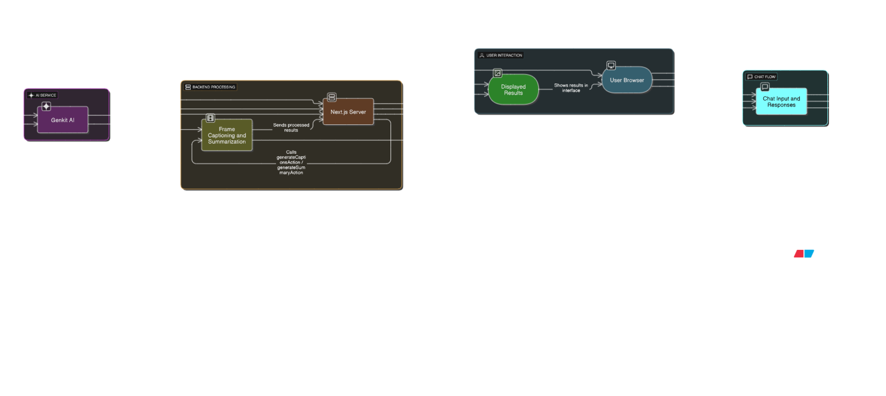

# VisionChat

## Project Overview

VisionChat is an AI-powered chat assistant that analyzes video content and allows users to have conversations about what's happening in the video. Users can upload a short video (up to 2 minutes), and the application will automatically extract key frames, generate descriptive captions, create a summary, and enable a conversational chat experience to ask detailed questions about the video's contents.

## Architecture

The application is built with a Next.js frontend and a Genkit AI backend. Here is a diagram illustrating the flow of data and interaction between the components:



## Tech Stack Justification

*   **Next.js**: Chosen for its robust, production-ready framework for React. Its features like Server Components, Server Actions, and an intuitive App Router allow for building a fast, modern, and scalable frontend. This is ideal for our interactive and media-heavy application.
*   **Genkit**: This open-source AI framework simplifies the development of AI-powered features. It provides a structured way to define AI flows, manage prompts, and integrate with models like Gemini, which was critical for building our video analysis and chatbot capabilities efficiently.
*   **Gemini Models (Google AI)**: We leverage the Gemini family of models for their powerful multimodal capabilities. The model's ability to reason over both text (summary, chat history) and image (video frames) data simultaneously allows for highly accurate and context-aware responses to user queries.
*   **TypeScript**: Used throughout the project to ensure type safety, which helps in catching errors early, improving code quality, and making the codebase easier to maintain and refactor.
*   **ShadCN UI & Tailwind CSS**: This combination was selected for its modern, component-based approach to UI development. It allows for rapid creation of a beautiful, responsive, and accessible user interface while maintaining a high degree of customization.

## Setup and Installation Instructions

To run this application on your local machine, follow these steps:

### 1. Clone the Repository

First, clone the project from GitHub to your local machine:
```bash
git clone <your-repository-url>
cd <repository-directory>
```

### 2. Set Up Environment Variables

You'll need a Google AI API key to use the AI features.

1.  Create a file named `.env` in the root of the project.
2.  Add your API key to the `.env` file like this:

    ```
    GENKIT_API_KEY=your_google_ai_api_key
    ```
    Replace `your_google_ai_api_key` with your actual key from Google AI Studio.

### 3. Install Dependencies

Open your terminal, navigate to the project's root directory, and run the following command to install the necessary packages:

```bash
npm install
```

### 4. Run the Development Server

In your terminal, run the following command to start both the Next.js frontend and the Genkit AI backend concurrently:

```bash
npm run dev:concurrent
```

This will start the frontend on `http://localhost:9002` and the Genkit AI service. Once both processes are running, you can open your browser to `http://localhost:9002` to use the application.

## Usage Instructions

1.  **Upload a Video**: Click the "Click to upload" area or drag and drop a video file (.mp4 or .mov) into the designated box. The video should be no longer than 2 minutes.
2.  **Process the Video**: Once the video is uploaded, click the "Process Video" button. The application will:
    *   Extract key frames from the video.
    *   Generate a caption for each frame.
    *   Create a high-level summary of the entire video.
    *   You can track the progress with the status bar.
3.  **View Analysis**: After processing, the "Analysis" tab will be populated. You can browse through the extracted frames and their captions in a carousel and read the overall summary below it.
4.  **Chat with the AI**:
    *   Navigate to the "Chat" tab.
    *   Type a question about the video into the input box at the bottom.
    *   Press Enter or click the send button.
    *   The VisionBot will answer your question based on the video's content, summary, and your conversation history.
    *Also it handle multi-conversions just like chatbots

### Example Conversational Queries:
*   "What was the main color of the car shown at the beginning?"
*   "Was there anyone walking on the street?"
*   "Describe the scene at the 15-second mark."
*   "How many people were in the video?"

## Demo Video

[https://drive.google.com/drive/folders/1Pupzw5y95RRjCuvtmP5krxwbxK_Qwztd]


---
*This project was developed for the Mantra Hackathon.*